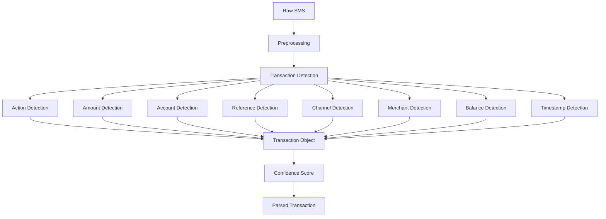

# Indian Bank SMS Parser Specification

Version: 1.0

## Overview

This document defines the standard rules for parsing Indian banking transaction SMS messages across:

* Public Sector Banks
* Private Banks
* Small Finance Banks
* UPI Applications
* Wallet Applications
* Credit Cards
* Debit Cards
* IMPS
* NEFT
* RTGS
* ATM Withdrawals
* NACH / ECS
* Standing Instructions

The goal is to achieve maximum transaction extraction coverage using a universal parser.

---

# Parsing Flow



---

# Output Schema

```json
{
  "transaction_type": "",
  "amount": "",
  "currency": "",
  "account_number": "",
  "account_type": "",
  "channel": "",
  "merchant": "",
  "vpa": "",
  "reference_id": "",
  "balance": "",
  "timestamp": "",
  "status": "",
  "confidence_score": ""
}
```

---

# 1. Transaction Type Detection

## Debit Keywords

```text
debited
withdrawn
spent
paid
deducted
charged
transferred
remitted
purchase
used
```

Normalize as:

```json
{
  "transaction_type": "DEBIT"
}
```

---

## Credit Keywords

```text
credited
received
deposited
salary
refund
reversal
cashback
interest
matured
lodged
```

Normalize as:

```json
{
  "transaction_type": "CREDIT"
}
```

---

# 2. Amount Detection

## Supported Formats

```text
Rs.500

Rs 500

INR 500

INR500

₹500

₹ 500

Rs. 1,25,000

INR 1,25,000.50
```

## Regex

```regex
(?:₹|INR|Rs\.?|rs\.?)\s*([\d,]+(?:\.\d{1,2})?)
```

## Normalization

Before:

```text
1,25,000.50
```

After:

```text
125000.50
```

---

# 3. Account Detection

## Supported Formats

```text
A/c XXXXX1234

A/c XX1234

Acct 1234

Account 1234

Account No 1234

Card ending 4321

Card XX4321

Wallet XX9876
```

## Regex

```regex
(?:A\/c|Acct|Account|Card|Wallet).*?([Xx*]*\d{2,10})
```

## Output

```json
{
  "account_number": "1234"
}
```

---

# 4. Reference Number Detection

## Supported Keywords

```text
Ref
Ref No
Reference
Txn ID
Transaction ID
UTR
RRN
IMPS Ref
UPI Ref
```

## Regex

```regex
(?:Ref(?: No)?|Txn ID|Transaction ID|UTR|RRN)\s*[:\-]?\s*([A-Za-z0-9]{6,25})
```

## Examples

```text
123456789012

ABER000123

CT00QNGIG5

432198765
```

---

# 5. Channel Detection

## UPI

Keywords:

```text
UPI
@ybl
@oksbi
@okaxis
@okhdfcbank
@ibl
```

Output:

```json
{
  "channel": "UPI"
}
```

---

## IMPS

Keywords:

```text
IMPS
```

Output:

```json
{
  "channel": "IMPS"
}
```

---

## NEFT

Keywords:

```text
NEFT
```

Output:

```json
{
  "channel": "NEFT"
}
```

---

## RTGS

Keywords:

```text
RTGS
```

Output:

```json
{
  "channel": "RTGS"
}
```

---

## ATM

Keywords:

```text
ATM
Cash Withdrawal
```

Output:

```json
{
  "channel": "ATM"
}
```

---

## POS

Keywords:

```text
POS
Swipe
Purchase
Tap
```

Output:

```json
{
  "channel": "POS"
}
```

---

## NACH

Keywords:

```text
NACH
ECS
ACH
```

Output:

```json
{
  "channel": "NACH"
}
```

---

# 6. Merchant Detection

## Examples

```text
SWIGGY

AMAZON

FLIPKART

ZOMATO

NETFLIX

ECS PAY

Anil Sharma

merchant@ybl
```

## Extraction Rules

Look after:

```text
to
at
for
via
merchant
```

Example:

```text
Paid to SWIGGY
```

Output:

```json
{
  "merchant": "SWIGGY"
}
```

---

# 7. VPA Detection

## Regex

```regex
[a-zA-Z0-9._-]+@[a-zA-Z0-9._-]+
```

Examples:

```text
merchant@ybl

9876543210@oksbi

john@okaxis
```

Output:

```json
{
  "vpa": "merchant@ybl"
}
```

---

# 8. Balance Detection

## Keywords

```text
Avl Bal

Avail Bal

Available Balance

Current Balance

Clear Balance

Bal
```

## Regex

```regex
(?:Balance|Bal|Avl Bal|Avail Bal).*?(?:₹|INR|Rs\.?)\s*([\d,]+(?:\.\d{1,2})?)
```

Output:

```json
{
  "balance": "15000.00"
}
```

---

# 9. Timestamp Detection

## Supported Formats

```text
05-02-19

05/02/2019

01-Jan-23

05-02-19 07:27:11 IST

08/AUG 10:55
```

## Date Regex

```regex
\d{1,2}[\/-]\d{1,2}[\/-]\d{2,4}
```

## Time Regex

```regex
\d{1,2}:\d{2}(?::\d{2})?
```

---

# 10. Status Detection

## Success

Keywords

```text
successful

completed

processed

credited

debited
```

Output

```json
{
  "status": "SUCCESS"
}
```

---

## Failed

Keywords

```text
failed

declined

unsuccessful

rejected
```

Output

```json
{
  "status": "FAILED"
}
```

---

## Refund

Keywords

```text
refund

refunded

reversal

reversed
```

Output

```json
{
  "status": "REFUND"
}
```

---

# Preprocessing Rules

Before parsing:

## Remove SMS Headers

Examples

```text
VK-HDFCBK

AD-SBIINB

JD-ICICIB

VM-KOTAKB
```

Regex

```regex
^[A-Z]{2}-[A-Z0-9]+
```

---

## Normalize Currency

Convert

```text
₹
Rs
Rs.
INR
```

To

```text
INR
```

---

## Normalize Amount

Convert

```text
1,25,000.50
```

To

```text
125000.50
```

---

## Convert To Lowercase

For keyword matching only.

---

# Confidence Score

## High Confidence (90-100)

Found:

* Transaction Type
* Amount
* Account

---

## Medium Confidence (70-89)

Found:

* Type
* Amount

Missing:

* Account

---

## Low Confidence (<70)

Missing:

* Amount

or

* Transaction Type

---

# Production Recommendation

Priority Extraction Order:

1. Transaction Type
2. Amount
3. Currency
4. Account Number
5. Reference ID
6. Channel
7. Merchant
8. VPA
9. Balance
10. Timestamp
11. Status

This extraction order provides the highest success rate across Indian banking SMS formats.
